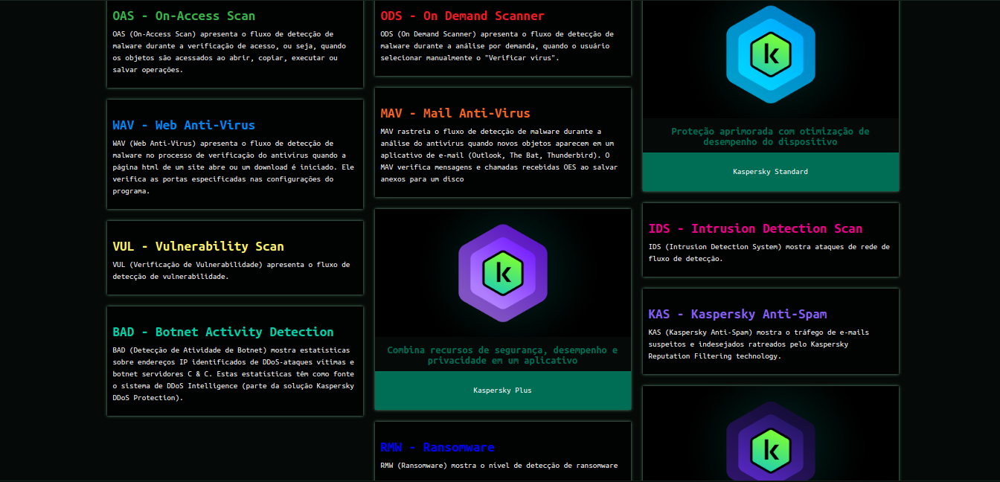

# Segurança de Redes

# Pilares da Segurança da Informação

- Confidencialidade: Garantia de que as informações serão acessadas por apenas pessoas autorizadas
- Integridade: Garantia que a informação não foi alterada ou corrompida de forma intencional ou acidental
- Disponibilidade: Capacidade de acessar a informação quando necessária
- Autenticidade: Caracteristica da informação que garante que ela é genuína e originada por uma fonte confiável
- Não-Repúdio: Capacidade de uma pessoa ou organização negar a autoria de uma ação realizada por ela
- Controle de acesso: Medida de segurança imporntate para garantir que apenas pessoas autorizadas tenham acesso a informações sensíveis
- Criptografia: Técnica utilizada para codificar informações de forma que apenas o destinatário correto possa decodifica-los
- Gerenciamento de Riscos: Processo fundamental para garantir a segurança da informação em uma organização

# Criptografía Simétrica e Assimétrica

É a conversão de dados de um formato legível em um formato codificado

## Chave Privada

Conciste em encriptar uma mensagem usando uma chave privada

## Chave Pública

Deve possuir duas Chaves: secreta e pública

## Criptografía Simétrica

Dos dois lados a chave é usada para encriptar e a mesma usada para decriptar uma mensagem (NRC2, N3DESM, NAES) - (AES, DES, 3DES -  Grandes quantidades de dados) 

- Não fornece o não-repúdio (Não garante que aquela pessoa é aquela pessoa)
- Mesma Chave para cifrar e para decifrar
- Mais rápida
- Problema nas distribuição das chaves

## Criptografía Assimétrica

A cahve usada para encriptar uma mensagem é diferente da chave usada para decriptar, dai o termo assimétrico (HTTPS, SSH) - (RSA, ECC, DSA - Pequenas quantidades de dados)

- Fornece o não-repúdio
- Chaves diferentes, gerando o par de chaves
- Mais lenta

# Algoritmos de Criptografía

SHA - Secure Hash Algorithm

- MD5: Hash de 128Bits = 16Bytes muito utilizado para softwares P2P (Ponto a Ponto), verificação de integridade e logins (Problema de Colisões - Duas entradas diferentes que geram o mesmo hash)
- SHA-1: Hash de 160Bits = 20Bytes. Usado numa grande variedade de aplicações, protocolos de segurança, incluindo (TLS, SSL, PGP, SSH e IPSec). É o algorítmo utilizado emoli para arquivos duplicados. (Problema de Colisões - Duas entradas diferentes que geram o mesmo hash)
- SHA-256: Hash de 256Bits = 32Bytes. Protocolo criptográfico utilizado principalmente em validações de transações de criptomoedas. Geração de assinaturas digitais, na autenticação de mensagens e em sistemas de blockchain.

## Utilizando o SHA-256 com Python

```python
from hashlib import sha256

message = input("Forneça sua mensagem: ")
print(message)

hash_message = sha256(message.encode())
message_storage = hash_message.hexdigest()
print(message_storage)
```

## Hash

Função de dispersão criptográfica ou função de hash é uma funçãoo matemática que transforma dados de entrada em um valor de HASH único.

Termo genérico que se refere ao processo de aplicar um algoritmo de resumo criptográfico a dados de entrada para gerar uma sequência de caracteres de tamanho fixo. Geralmente, quando se fala em "HASH", está se referindo a um resumo criptográfico gerado por um algoritmo como MD5, SHA-1 ou SHA-256.

# Ataques

1. **Malware:** Software malicioso projetado para danificar ou infiltrar sistemas de computador. Exemplos incluem vírus, worms, cavalos de Troia e ransomware.
2. **Phishing:** Um ataque que envolve o envio de e-mails fraudulentos que parecem ser de fontes legítimas para enganar as pessoas e fazer com que revelem informações confidenciais, como senhas ou números de cartão de crédito.
3. **Ataques de negação de serviço (DDoS):** Tentativas de inundar um sistema ou rede com um tráfego excessivo para torná-lo inacessível para os usuários legítimos.
4. **Ataques de ransomware:** Um tipo de malware que criptografa os dados da vítima e exige um resgate em troca da chave de descriptografia.
5. **Ataques de worm:** Um tipo de malware que se propaga automaticamente por sistemas e redes sem intervenção humana.
6. **Vírus:** Um vírus é um programa de computador malicioso que se anexa a um arquivo ou programa legítimo, infectando-o. Quando esse arquivo é executado, o vírus se espalha para outros arquivos e pode causar danos ao sistema ou roubar informações. Vírus geralmente requerem uma ação do usuário para se propagar, como abrir um anexo de e-mail infectado.
7. **Injeção de SQL:** Um ataque no qual um invasor insere código SQL malicioso em uma consulta de banco de dados para obter acesso não autorizado ao banco de dados.
8. **Ataques de força bruta:** Um ataque no qual um invasor tenta adivinhar senhas ou chaves testando várias combinações até encontrar a correta.
9. **Ataques de spoofing:** Manipulação do endereço IP ou do nome de domínio para fazer com que uma comunicação pareça vir de uma fonte confiável.
10. **Ataques de engenharia social:** Manipulação psicológica de indivíduos para obter informações confidenciais ou acesso a sistemas.
11. **Ataques Man-in-the-Middle (MitM):** Um invasor intercepta e modifica a comunicação entre duas partes sem que nenhuma das partes saiba disso.
12. **Ataques de dia zero:** Ataques que exploram vulnerabilidades desconhecidas em software ou hardware antes que os desenvolvedores tenham a chance de corrigi-las.
13. **Ataques de rede:** Tentativas de penetrar na infraestrutura de rede para roubar dados ou comprometer sistemas.
14. **Ataques de infiltração:** Tentativas de acessar uma rede ou sistema interno de uma organização com o objetivo de roubar informações ou causar danos.
15. **Ataques de varredura de portas:** Varredura de uma rede para identificar serviços e portas abertas, muitas vezes como preparação para um ataque posterior.
16. **Ataques de sniffing:** A interceptação e captura de dados de tráfego de rede não criptografados para análise ou roubo posterior.
17. **Ataques de botnet:** O controle de uma rede de dispositivos comprometidos para realizar ações maliciosas, como DDoS ou outros ataques.

# Cybermap da Kaspersky

Ele é um mapa onde você pode acompanhar em tempo real as ameaças cibernéticas de todo o mundo.



# Cifra de César

A cifra de César, também conhecida como cifra de troca, é um dos métodos mais simples e conhecidos de criptografia. Ela recebe esse nome em homenagem a Júlio César, o famoso imperador romano, que é creditado com seu uso histórico. A cifra de César é um tipo de cifra de substituição, onde cada letra do texto original é deslocada por um número fixo de posições no alfabeto. O deslocamento é chamado de "chave" e determina como a cifra funciona.

Por exemplo, se a chave for 3, cada letra do texto original será substituída pela letra que está três posições à frente no alfabeto. Portanto, "A" se tornaria "D", "B" se tornaria "E", "C" se tornaria "F", e assim por diante. Se a chave for negativa, o deslocamento ocorre no sentido contrário.

A cifra de César é um exemplo de criptografia de fácil implementação, mas também é extremamente fraca do ponto de vista da segurança, pois há apenas 25 (ou 26, se considerarmos o espaço) possíveis chaves a serem testadas. Isso a torna vulnerável a ataques de força bruta, onde todas as combinações possíveis são testadas até que o texto original seja recuperado. Portanto, é geralmente usada apenas para fins educacionais e lúdicos, e não para proteger informações sensíveis.

## eMule

Em computação, eMule é um aplicativo de compartilhamento de arquivos através de cliente/servidor que trabalha com as redes eDonkey2000 e Kad oferecendo mais funções do que o cliente eDonkey padrão. O eMule é um software livre lançado sob a GNU General Public License. Possui versões para Microsoft Windows.