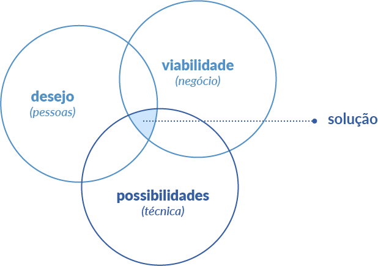

# Design Thinking
- Modelo de pensamento que vai além da necessidade de criar um produto.
- A ideia é entrar na vida do consumidor e procurar ditar comportamentos e necessidades.

## Bases
1. Empatia
2. Experimentação
3. Prototipação

O Design thinking é centrado no humano, altamente colaborativo, experimental, otimista.

## O processo
- Insights 
- Ideias
- Protótipos
- Realização

## Pilares
1. Viablidade
2. Praticabilidade
3. Desejabilidade

## Ferramentas
1. Brainstorm
2. Mapas Mentais
3. Mapa de Empatia
4. Prototipagem
5. Cocriação
6. Story Board

# MVP - Mínimo Produto Viável
- **Pode ser entendido como:** "Uma forma simples de testar a execução de uma ideia" - Maria Lemos
- **A ideia principal consistem em:** Consigo aprender de forma rápida qual produto ideal para meu cliente?

## Tipos de MVP
1. **MVP Fumaça:** Avalia o interesse de cliente por meio de um canal de marketing, responsável pela distribuição e apresentação da solução ao público.
2. **MVP Concirge:** Se propoem a entender o que os clientes precisam de uma maneira mais próxima e personalizada.
3. **MVP Mágico de Oz:** A interface de aplicativo já estar pronta e funcionamento nas mãos dos usuários para testes.
4. **MVP Protótipo:** Funciona por meio da criação de um exemplar funcional do produto ou serviço para que os usuários possam testar e avaliar
5. **MVP Duplo:** Um teste A/B do MVP para analisar sua aceitação, performace, experiencia dos usuários e todas as especificações envolvidas no projeto

# Pitch
- É uma apresentação breve do seu negócio que costuma ser feita para investidores.
- Também pode ser utilizada para apresentar um produto / serviço para clientes.

## Como construir um Pitch?
1. Qual é o seu problema / oportunidade?
2. Qual a solução da sua empresa?
3. Quais são os diferenciais da inicidativa?
4. Em qual momento o negócio está?
5. Qual a proposta?

## Dicas
- Faça apresentações sucintas;
- Capriche no storyteling;
- Confie no seu potencial

# Tipos de Pitch
1. Pitch profissional pessoal
2. Pitch de vendas de produtos
3. Video Pitch